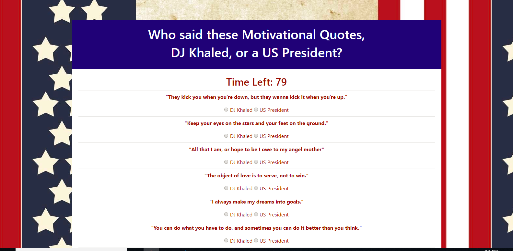

# Triviagame
A simple timed trivia game with binary choices for answers.

# Link to Deployed Site
[Trivia-game](https://aehaq.github.io/Triviagame/)

# Images


# Technology Used
- html
- CSS (Bootstrap)
- javascript (jQuery)

# Code Snippets
```
    $("#start").on("click", function() {
        ...

        for (let i = 0; i < 10; i++) {

            print.append('<hr class="my-2"><p class="question">"' + quotes[i] + '"</p>');

            if (khalidQuote[i]) {
                print.append('<form>    <input type="radio" name="q'+i+'" value="right"> DJ Khaled    <input type="radio" name="q'+i+'" value="wrong"> US President </form>')
            } else {
                print.append('<form>    <input type="radio" name="q'+i+'" value="wrong"> DJ Khaled    <input type="radio" name="q'+i+'" value="right"> US President </form>')
            }
        }

        ...
    })

```
In the code above I attempted to cover a lot of ground in a few lines of code. After clearing the page and printing the clock within the above function (cropped out of this snippet), I need to print 10 different questions, each with a set of two different radio buttons with hidden values of either correct or incorrect. In order to do this I simultaneously accessed two corresponding lists within the same for loop, one list containing the questions and one list containing the answers. After printing each question, I then determine which of the two results is true, and print the buttons on page with the correct values already assigned. While doing this, I also made sure to give each set of radio buttons a unique id corresponding to the question they respond to by calling the index number within the printed html.

# Learning Points
- Creating timed events, in this case a countdown clock, where a function is run every second, and a function is triggered when a certain time has been reached.
- Creating events that interact with timed functions, such as stopping a countdown to prevent excess instances of functions running..
- Clearing and writing in certain divs upon the execution of certain functions and the instancing of certain events.
- Using a for loop to procedurally generate various elements according to details stored in multiple lists.
- Using radio-buttons to handle and store binary values, and calling upon those values to record data.
- Identifying the best instances to store values when you need to remove associated elements from the page.

# Author 
Azfar Haq - [GitHub](https://github.com/aehaq)

# License
Standard MIT License